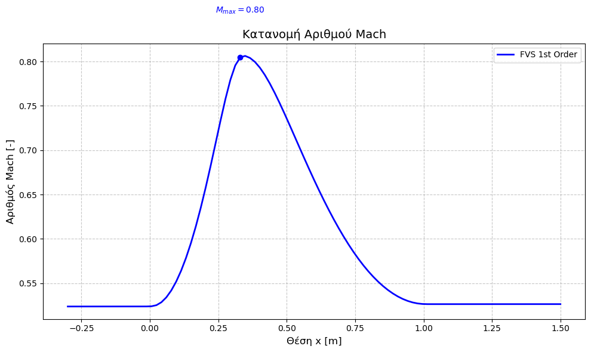
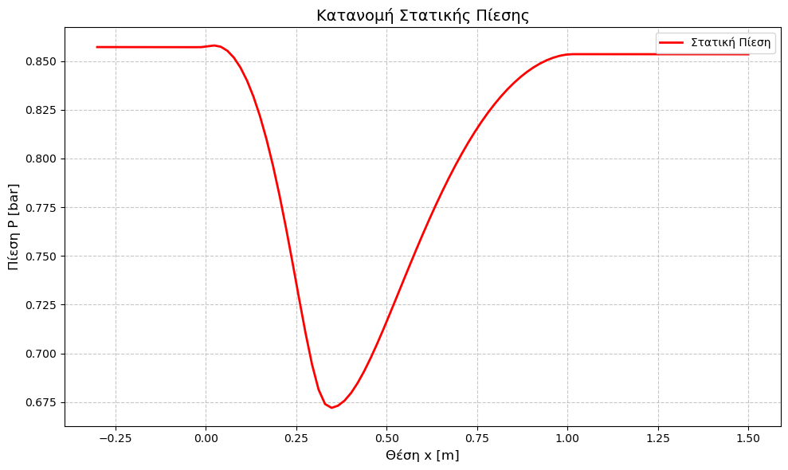

# C++ CFD Solver: Quasi-1D Euler Equations

A high-performance Computational Fluid Dynamics (CFD) solver written in standard **C++20**. The solver simulates compressible, inviscid gas dynamics (Euler equations) in a converging-diverging nozzle using the Finite Volume Method (FVM).

## 📌 Project Overview
This project focuses on the numerical simulation of compressible flows. It explores advanced numerical schemes for hyperbolic partial differential equations, which are fundamental in aerospace and aerodynamic applications. By implementing the solver in C++ from scratch, the project demonstrates high proficiency in computational efficiency, memory management, and numerical analysis without relying on commercial "black-box" CFD software.

## 🚀 Key Implementations

* **Governing Equations:** Solves the fully coupled Quasi-1D Euler equations (Conservation of Mass, Momentum, and Energy) incorporating source terms for geometric variations.
* **Numerical Schemes:** Implements state-of-the-art shock-capturing schemes:
  * **Flux Vector Splitting (FVS):** Van Leer and Steger-Warming methods.
  * **Approximate Riemann Solver:** Roe's flux-difference splitting scheme.
* **Spatial Accuracy:** Features both 1st-order and 2nd-order spatial discretization configurations.
* **Geometric Modeling:** Precise nozzle area ($S(x)$) definition based on specific convergence/divergence profiles.

## 📊 Results & Aerodynamics
The solver successfully captures pressure and Mach number distributions within the nozzle, showing robust agreement with isentropic analytical solutions.

### Mach Number Distribution

### Pressure Profiles

## 🛠️ Tech Stack
* **Language:** C++20
* **Build System:** CMake
* **Mathematics:** Standard Library (cmath, vector)
* **Post-Processing:** Python (matplotlib for visualization and validation)

## 💻 Repository Structure
* `src/`: Contains the C++ source code (`main.cpp`) including the FVM solver logic, flux schemes, and state vector operations.
* `images/`: Validation plots comparing numerical results against analytical benchmarks.
* `CMakeLists.txt`: Build configuration file for compilation.
